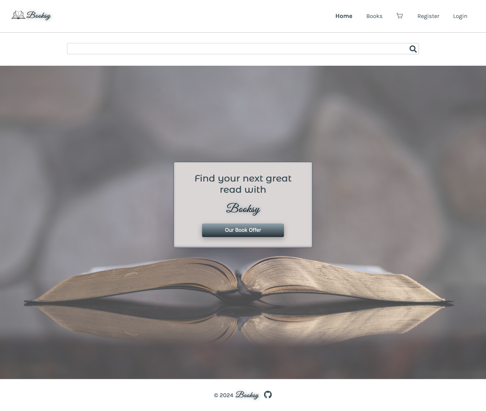
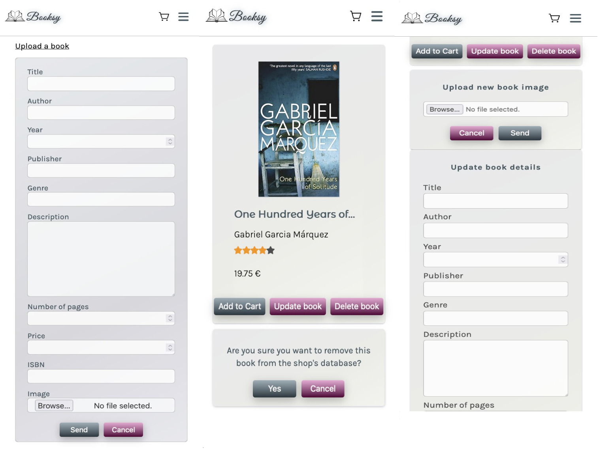

# Booksy Project

Booksy is a lightweight E-Commerce platform developed as the final project during the 1-year full-stack web development course at DCI. This repository serves as the monorepo of the Booksy application, catering specifically to the needs of a small independent bookstore.




Booksy enables users to register, create and manage a custom profile. Users can connect over sharing reviews of their favourite books. Admin users have access to additional profile functionalities through the admin dashboard. They can upload new books, edit existing ones and delete products from assortment.



## Technologies

Booksy aims to keep dependencies low while still providing essential features for managing an online bookstore.

### Frontend

- Bootstrapped with Vite
- React
- React-Router-DOM
- React-hottoast
- React-icons
- SCSS

### Backend

- Express
- Mongoose
- Validation via JWT and express-validator
- Express-fileupload

## Deployment

To see the live version please visit:

https://test-y6oh.onrender.com/

## Getting started

1. Clone the repository

```bash
git clone https://github.com/pozniej-znajde-wolne-haslo/booksy_frontend.git
```

2. Install dependencies

```bash
npm install
```

3. Start local backend server (see Backend repository)

4. Start local development server

```bash
npm run dev
```

Booksy's frontend should be running on `http://localhost:5173`.
